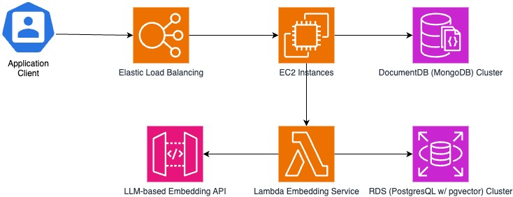

# JustVent
Mindfulness & Journaling App
## Inspiration
We wanted to make a product that will help people understand their emotions and themselves better.
## Core Idea
A self-reflection app that helps users with guided journaling based on mindfulness principles. It provides daily prompts to help users reflect on their day and set goals for emotional, mental, and spiritual growth.
## What it does
It's a journaling app that listens to you. The idea is that once a day you journal how your day went. The application will then track the emotions you felt that day based on what you wrote. You can then check out the dashboard to see how you felt over a selected period of time. The goal is that as you use the application your emotions will be more and more positive overtime.
## How we built it
We built the frontend of our webapp using React. For our backend we used Python with FastApi. Our database is MongoDB and we have everything running of an Amazon ec2 instance with MongoDB on a DocumentDB cluster. We used J Hartmann's fine tuned model Emotion English DistilRoBERTa-base to classify text into emotions [[1]](#1). This model can classify text into 7 different emotions based on a score:
1. Anger
2. Disgust
3. Fear
4. Joy
5. Neutral
6. Sadness
7. Surprise

We split each journal entry by sentence, then classify each emotion detected by the model. Using the emotions detected we can keep track of the users progress and what main emotions they felt each day. The goal is for as users continue using this model they will tend to feel more positive emotions and less negative emotions overtime. This is thanks to gratitude. We expect each user at the end of their journal entry to write one thing they are thankful for that day. Research has shown that people who tend to focus more on what they're thankful for tend to be happier [[2]](#2).

Semantic search using vector embeddings functions in the same manner. When a journal is uploaded, it is chunked out into smaller portions, and each one is sent to a 3rd party LLM-based text embedding API. We retrieve these vector embeddings and store them in PostgresQL for future querying. When a user wishes to use semantic search, we embed their search term and query the database to find the terms with the closest cosine similarity.

## Challenges we ran into
We got blocked a lot with being unable to connect to our DB due to our load balancer overloaded. This caused us to have to wasted a lot of time as we waited for it to restart.
## Accomplishments that we're proud of
We are proud of having complete all the goals we set for ourselves when designing our project. We managed to create a working product in 36 hours.
## What we learned
We learned plenty of new things. We learnt how to use pytorch and train it with a model based on the specifications we required. We learnt how to use AWS and the challenges of deploying multiservice applications. We learnt how to implement voice to text on a website. We also learnt how to create and use custom API endpoints.
## What's next for JustVent
- Upgrading our infrastructure
- Improving our UI
- Adding new features
- Implementing a subscription model
- Adding secure authentication
## Features
- Mood tracker (connected to journal entries)
- Personalized affirmations based on previous entries
- Visual data representation of growth (e.g., charts showing emotional growth)
## Architecture

The client application connects to our backend through AWS Elastic Load Balancers, where our main backend is hosted on an EC2 instance. The EC2 instance communicates with an AWS DocumentDB cluster, which contains the main application data. The text vector embeddings are managed by a microservice powered by AWS Lambda; utilizing a third-party LLM-based embedding model, and storing and querying high-dimension-space vector embeddings in Amazon RDS using PostgresQL with the pgvector extension.

## Tech Stack
- Frontend:
  - React
  - TailwindCSS
  - Mantine UI
- Backend:
  - Python
  - FastAPI
  - Bash (deployment scripts)
- Databases:
  - MongoDB
  - PostgresQL (with pgvector)
- Infrastructure
  - AWS (ELB, EC2, DocumentDB, Lambda, RDS)
  - Nginx

## References
<a id="1">[1]<a>
https://huggingface.co/j-hartmann/emotion-english-distilroberta-base 

<a id="2">[2]<a>
https://www.health.harvard.edu/healthbeat/giving-thanks-can-make-you-happier#:~:text=In%20positive%20psychology%20research%2C%20gratitude,express%20gratitude%20in%20multiple%20ways
